# Payments: how money moves through Camphoric

This guide is for developers. It follows a registrant's money from the registration form to the
admin's ledger: what the person sees, what the browser (`client_v2`) does, and what the server
(and PayPal) do. The binding rules are in [`SPEC_CLIENT_V2.md`](../SPEC_CLIENT_V2.md): §5 (the API
contracts), §7.2 (the payment step), §8.4 (the admin), §9.7 (invoices, payments and balance) and
decision records DR-87 to DR-96. When the two disagree, the spec wins — and this guide should be
fixed.

## 1. Glossary

- **Invoice** — a request for one chunk of a registration's balance: an **amount** toward the
  registration, plus a **handling** fee once it's paid online. Every payment belongs to exactly
  one invoice; an invoice can hold several payments and refunds.
- **Payment** — money received (`amount > 0`) or given back (`amount < 0`, a **refund**), on an
  invoice.
- **Payment option** — one of the event's deposit choices ("Full Payment", "50% Deposit"),
  worked out by the server into an amount.
- **Handling fee** — the event's `epayment_handling` percent, charged on an invoice's amount when
  that invoice is paid online. It is *not* part of the price.
- **Ledger** — a registration's `total_owed`, `total_paid` and `balance`, worked out from its
  price, invoices and payments.
- **Pending PayPal order** — an order the server created for an invoice that hasn't been captured
  (yet). Nothing is owed for it until it is.
- **Approve vs. capture** — a payer *approves* an order in PayPal's window; no money moves until
  the server *captures* it.
- **"Deposit" means two things.** The registrant's *deposit option* (a payment option, above)
  and the `Deposit` model — a *bank deposit* grouping payments, which has nothing to do with it.

### Where invoices come from

Every invoice records its `origin`. It's informational — it never changes the ledger.

| Origin | Made by | When | Typical description | Special behavior |
|---|---|---|---|---|
| `registration` | the payment step | the registrant presses a payment button for an option that asks for money (at most one per registration) | the option's title, e.g. "50% Deposit" | rewritten in place by the payment step while nothing is paid on it (they change option or method); templates call it `registration.invoice` |
| `payment_received` | recording a payment | a registrar records a payment and no invoice has money due (a surprise check, an overpayment, a donation), or chooses "On its own" | "Payment received" ("Refund given" for a refund converted from before invoices) | its amount always equals what its live payments net to, so it never shows money owed; cancelled when its payments are deleted, reopened on restore (`match_received_invoice`) |
| `admin` | a registrar, by hand | "New invoice": for the balance no invoice asks for yet, or a meal plan added later (§15) | whatever the registrar types, "Registration balance" to start with | none: an ordinary bill, with a pay link that can be emailed |
| `migrated` | migration 0076 only | an old registration's handling fee had nowhere else to go | "Electronic payment handling" | amount 0, only `handling`; no new ones are made |

## 2. Data model

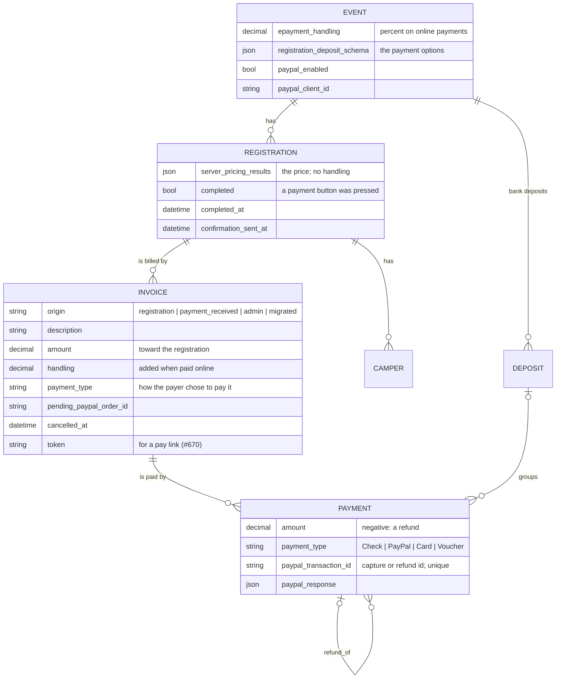

## 3. The ledger

```
total_owed = price total + Σ handling of invoices that aren't cancelled
total_paid = Σ live payments (refunds are negative)
balance    = total_owed − total_paid            (negative: a refund is due)
uninvoiced = balance − Σ amount_due of open invoices   (never below 0)
```

`invoices.ledgers()` works these out for many registrations in two queries; the registration
serializer adds them to `/api/registrations/`, and `templating/graph.py` gives templates the same
numbers.

A worked Lark example: two adults, price $1,000, of which tuition and meals are $1,000. Lark's
"50% Deposit" option comes to $500; the handling percent is 2.5%.

| Step | Invoices | total_owed | total_paid | balance | uninvoiced |
|---|---|---|---|---|---|
| They press **Pay $500 by check** | #1 "50% Deposit" $500, open | $1,000 | $0 | $1,000 | $500 |
| The registrar records the $500 check | #1 paid | $1,000 | $500 | $500 | $500 |
| A registrar invoices the balance (#670) | #2 "Registration balance" $500, open | $1,000 | $500 | $500 | $0 |
| They pay #2 online: $500 + $12.50 handling | #2 paid, handling $12.50 | $1,012.50 | $1,012.50 | $0 | $0 |

## 4. A registration's states

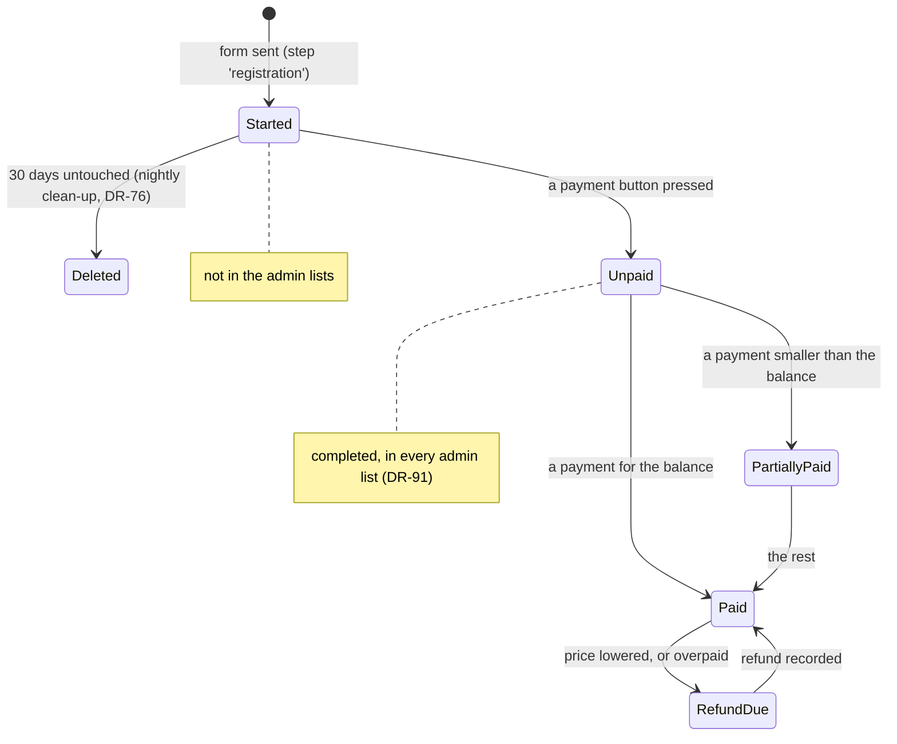

## 5. The registration flow

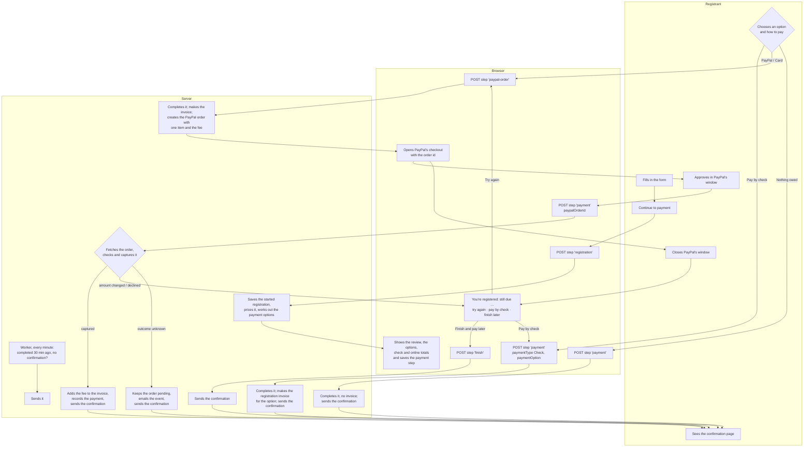

- The registration is **started** when the form is sent, and **completed** the moment a payment
  button is pressed (`RegisterView.complete`). It's in the admin lists from then on.
- The browser saves the payment step in localStorage
  (`pages/register/storage.ts`), so a reload — or coming back after closing PayPal's window —
  resumes paying for the same registration. Coming back to the form offers "Continue to payment"
  or "Start a new registration".
- While nothing is paid on the registration invoice, the registrant can change option or method;
  `prepare_registration_invoice` rewrites it in place (and does nothing on an identical repeat).

## 6. Paying online, step by step

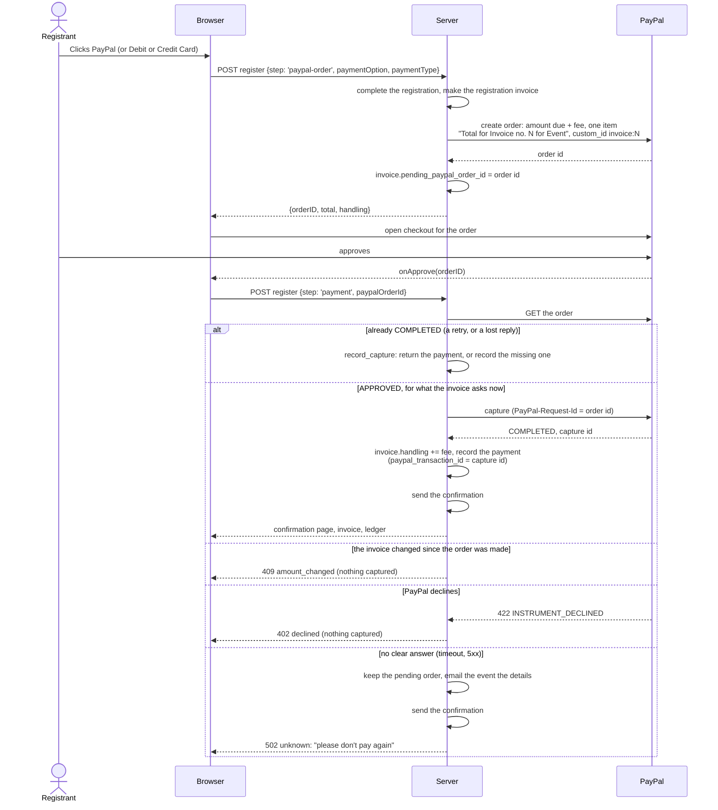

- **Why approve isn't enough.** Approval only means the payer agreed; the server's capture is
  where money moves, after the server has checked the order is this invoice's and for the amount
  it asks *now*. So a stale page, a tampered amount or an invoice edited meanwhile can't take the
  wrong amount (#675).
- **Why `paypal_transaction_id` is unique.** It's PayPal's capture id (or refund id). Fetching the
  order first means a retried call, a double click, a lost capture reply or "Check PayPal order"
  after a capture all find it already captured and return the existing payment — one PayPal
  transaction is never recorded twice. The `PayPal-Request-Id` header makes PayPal itself return
  its first answer to a retried create, capture or refund.
- **The fee** isn't saved on the invoice until the capture, so an abandoned order adds nothing to
  what's owed.
- **When PayPal's buttons can't load.** The buttons come from PayPal's script, loaded with the
  event's `paypal_client_id`. If PayPal refuses that id ("client-id not recognized" — e.g. an id
  from another PayPal account, or a sandbox id against live), a blocker stops the script, or
  PayPal is down, the payment step and the pay page say online payment isn't available instead
  of showing buttons (`PayPalCheckout`). Nothing reaches the server, so there's nothing to clean
  up; the fix is the event's client id (it must belong to the same PayPal app as the server's
  `PAYPAL_SECRET`, on the same sandbox or live `PAYPAL_BASE_URL`).
- **The PayPal problem email** (`invoices.send_paypal_problem_report`, kind `payment_report`) goes
  to the event's `confirmation_email_from`, once per order: what happened, who (registration,
  registrant, campers, an admin link), what for (invoice, amounts, payment type), PayPal's
  references and error, what the registrant was told, and what to do. Without an event address
  it's only logged (always at ERROR).
- **"Check PayPal order"** on the invoice (`/api/invoices/{id}/check-paypal/`) asks PayPal about the
  pending order: COMPLETED is recorded; anything else is cleared (no money was taken).

## 7. Paying by check

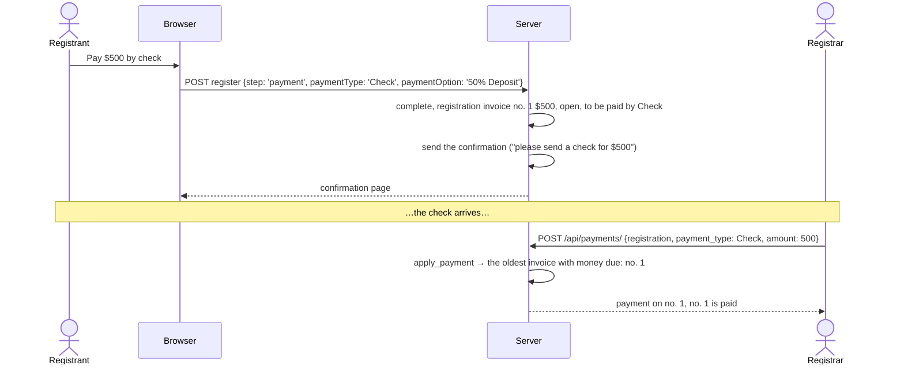

## 8. When the confirmation email goes out

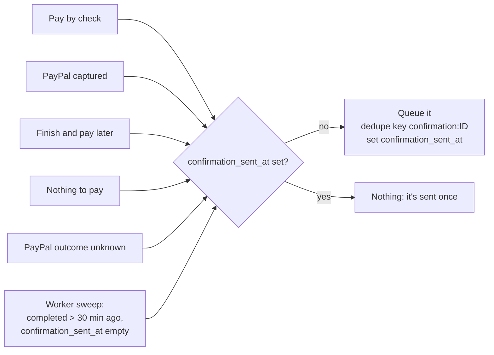

`confirmations.send_confirmation` does the sending; `confirmations.send_overdue_confirmations`
is the sweep, called from the worker's `reconcile` task. Registrations converted by migration 0076
have `confirmation_sent_at` set, so the sweep never emails anyone from before.

## 9. Recording a payment (admin)

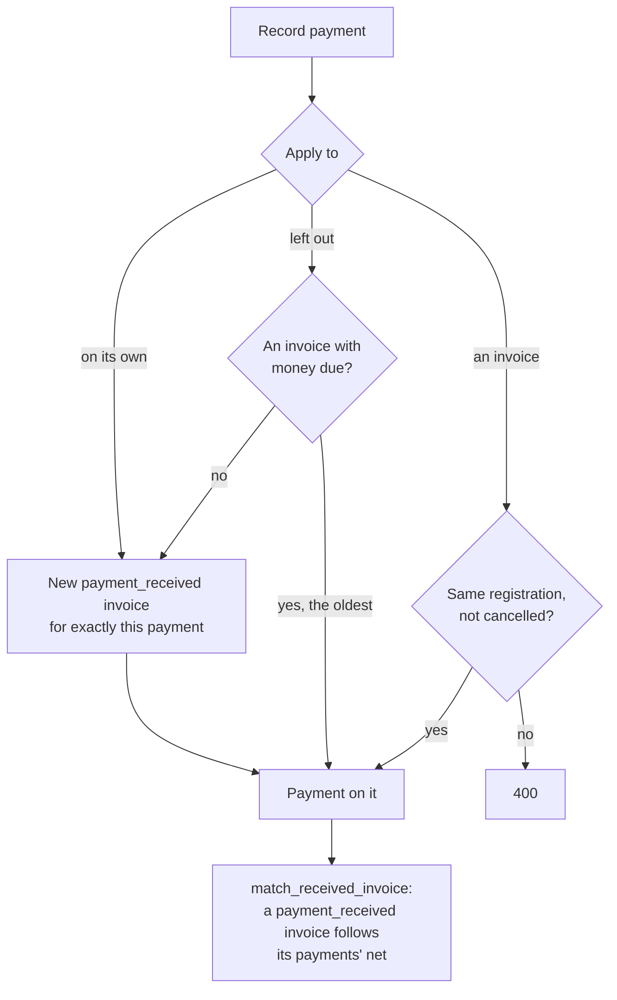

- Two checks on one invoice: a $500 deposit invoice gets a $450 check (partially paid, $50 due),
  then a $50 check (paid).
- `match_received_invoice` keeps a `payment_received` invoice honest: correct a $20 typo to $200
  and the invoice becomes $200 (not "overpaid by $180"); delete the payment (Admins only) and the
  invoice is cancelled (not "$200 due"); restore it and the invoice reopens.
- A payment saved any other way (Django admin, a shell) without an invoice gets one the same way
  (`Payment.save`).

## 10. An invoice's lifecycle

```mermaid
stateDiagram-v2
    [*] --> Open
    Open --> PartiallyPaid: a payment less than due
    Open --> Paid: payments = total
    PartiallyPaid --> Paid: the rest
    Paid --> Overpaid: more paid than the total<br/>(or its amount lowered)
    Overpaid --> Paid: refund the difference
    Paid --> PartiallyPaid: a refund, or its amount raised
    Open --> Cancelled: cancel (it holds no money)
    Cancelled --> Open: reopen
    Paid --> Cancelled: cancel, once refunded to 0
    Open --> [*]: delete (Admins; nothing ever paid on it)
```

Status is never stored: `Invoice.status` (and `templating/graph.invoice_status`) work it out from
`cancelled_at`, the total and the live payments' net.

## 11. Refunds

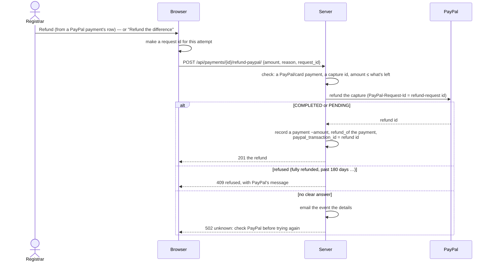

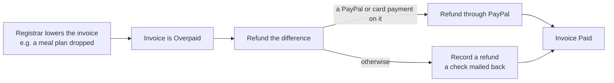

- A check mailed back is recorded by hand: a negative payment with `refund_of`.
- Refunding doesn't change the handling fee: if the organizers' policy is to return the fee,
  the registrar edits the invoice's handling too.
- A converted PayPal payment whose verification had failed back then has no capture id, so it
  can only be refunded in PayPal's dashboard and then recorded here.

## 12. The handling fee, and who can do what

- The fee is `pricing.handling_fee(amount, percent)`: the percent of the amount, in cents, a
  half cent up (2.5% of $7 is $0.175 → $0.18). The client's `pricing/handlingFee.ts` is the same
  function, kept in step by `pricing/test/handlingFee.fixtures.ts` and `TestHandlingFeeRounding`.
- It's added when an invoice is captured online, on what the invoice still asked
  (`online_fee`). An invoice that already has a fee gets none added. Paying by check adds none.
- Registrars change it on the invoice; "Calculate" suggests `handlingFee(amount − paid, percent)`.

| | Admin | Registrar | Reporter |
|---|---|---|---|
| See invoices, payments, notes | ✓ | ✓ | ✓ |
| Record a payment | ✓ | ✓ | |
| Edit an invoice (amount, handling, memo, notes, due date) | ✓ | ✓ | |
| Cancel / reopen an invoice | ✓ | ✓ | |
| Check a PayPal order | ✓ | ✓ | |
| Refund (through PayPal or recorded) | ✓ | ✓ | |
| Restore a deleted payment | ✓ | ✓ | |
| Make an invoice, or invoice the balance | ✓ | ✓ | |
| Send an invoice (the invoice email) | ✓ | ✓ | |
| Copy an invoice's pay link | ✓ | ✓ | ✓ |
| Delete a payment | ✓ | | |
| Delete an invoice (nothing ever paid on it) | ✓ | | |

## 13. Templates

- `registration.invoices`, `registration.invoice` (the registration invoice) and the `invoice`
  root of the confirmation email and page; `invoices` in reports; `payment.invoice`,
  `payment.is_refund`, `payment.refund_of`, `payment.paypal_response`.
- `registration.total_owed` includes the handling fees; `total_paid` is net of refunds;
  `balance` can be negative.
- For older templates, these are still there, worked out from the registration invoice:
  `registration.payment_type` (its payment type), `initial_payment` (`type` = its description,
  `total` = its total, `balance` = `total_owed − total`) and `registration.paypal_response` (its
  PayPal payment's record). `pricing.handling` is gone.
- `invoice.pay_url` is the invoice's public pay page (§15). The `invoice_email` context — the
  event's invoice email — has `event`, `invoice`, `registration` and `campers`. A confirmation
  email can link to `registration.invoice.pay_url` when something is still due.
- Confirmation templates must read well when nothing is paid yet: a check to send, or an online
  payment that didn't go through (`invoice.amount_due`, `invoice.payment_type`).

## 14. Code map

**Server** (`server/camphoric/`)
- `invoices.py` — the ledger (`ledgers`, `ledger`), `invoice_for_payment`,
  `match_received_invoice`, `refundable`, payment options (`payment_options`, `find_option`),
  the registration invoice (`prepare_registration_invoice`), PayPal (`create_paypal_order`,
  `capture_paypal_order`, `record_capture`, `check_paypal_order`, `refund_paypal_payment`) and the
  problem email.
- `paypal.py` — `PayPalClient`: fetch, create, capture, refund; `PayPalError(unknown=…)`.
- `confirmations.py` — sending the confirmation, problem reports, the overdue sweep.
- `views.py` — `RegisterView` (the `registration`, `paypal-order`, `payment` and `finish` steps),
  `InvoiceViewSet` (with `send`), `RegistrationViewSet.invoice_balance`, `PaymentViewSet` (with
  `refund-paypal`), and `InvoicePayView`, the public pay page's API.
- `serializers.py` — `InvoiceSerializer`, `PaymentSerializer`, the registration's ledger fields.
- `models.py` — `Invoice`, `Payment` (`invoice`, `refund_of`, `paypal_transaction_id`), the
  registration's `completed_at` and `confirmation_sent_at`.
- `templating/graph.py`, `templating/registry.py` — the template variables;
  `templating/emails.py` `render_invoice_email` and `templating/urls.py` `invoice_pay_url`.
- `migrations/0075`–`0077` — the schema, the conversion, and the clean-up; `0078` — the invoice
  email template.

**Client** (`client_v2/src/`)
- `pages/register/payment/PaymentNeeded.tsx` — the payment step;
  `PaymentOptions/`, `PaymentNotFinished.tsx`, `components/PayPalCheckout/`.
- `pages/register/storage.ts` — the saved payment step.
- `store/registrationApi.ts` — the register steps and `paymentProblem`.
- `pages/admin/registrations/invoices/` — the admin's ledger, invoices, payments and refunds;
  `store/invoices.ts` — their actions; `NewInvoiceModal.tsx` — making an invoice.
- `pages/invoice/` — the public pay page (`InvoicePayPage`, `InvoiceSummary`);
  `store/invoicePay.ts` — its API.
- `store/augmented.ts` — the server's ledger under the older report names.

## 15. Invoicing later, and the public pay page (#670, #623)

A registration can owe more after it registers: the rest after a deposit, a meal plan added
later, or a check that never came. A registrar makes an **invoice** for it and sends the payer its
**pay link**; the payer opens the link and pays online. The same page lets a check registrant
switch to PayPal after all — the fee is added only then (#623). Spec: §8.3, §8.4, §9.7, DR-95 and
DR-96.

### Making and sending an invoice

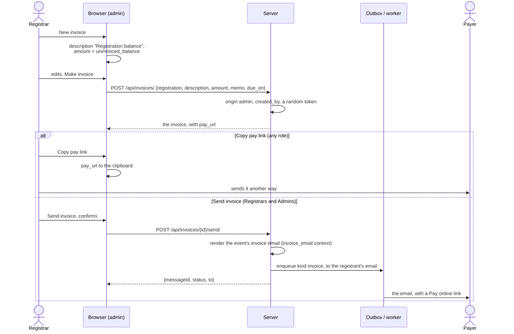

- **What it asks for.** An `admin` invoice is an ordinary bill: its `amount` adds to what the
  open invoices ask, and its status follows its payments like any other. "New invoice" starts
  with the registration's `uninvoiced_balance` — what no open invoice asks for yet — so
  invoicing the balance never asks twice for the same money. `POST
  /api/registrations/{id}/invoice-balance/` does the same in one call (409 when there's nothing
  left to invoice).
- **The invoice email** is an email template that comes with the event (`Event.invoice_template`,
  purpose `invoice`, made by migration 0078 for existing events), edited on Home beside the
  confirmation email. Its `invoice_email` context has `event`, `invoice` (with `pay_url`),
  `registration` and `campers`. The default shows the memo, the campers' first names, the
  description, amount due and due date, and `[Pay online]({{ invoice.pay_url }})`. A template
  that can't render sends nothing (400 with its diagnostics); a cancelled invoice can't be sent
  (409). The email shows in the registration's email history, kind "Invoice".
- **The link.** Every invoice gets `token = secrets.token_urlsafe(24)` when it's made — 32
  characters nobody can guess. `pay_url` is `{CAMPHORIC_PUBLIC_URL}/invoices/{token}`, or the
  request's host when that isn't set (port 8000 swapped for the dev server's 3000). The token
  itself is never in the admin API; `pay_url` is.

### Paying through the link

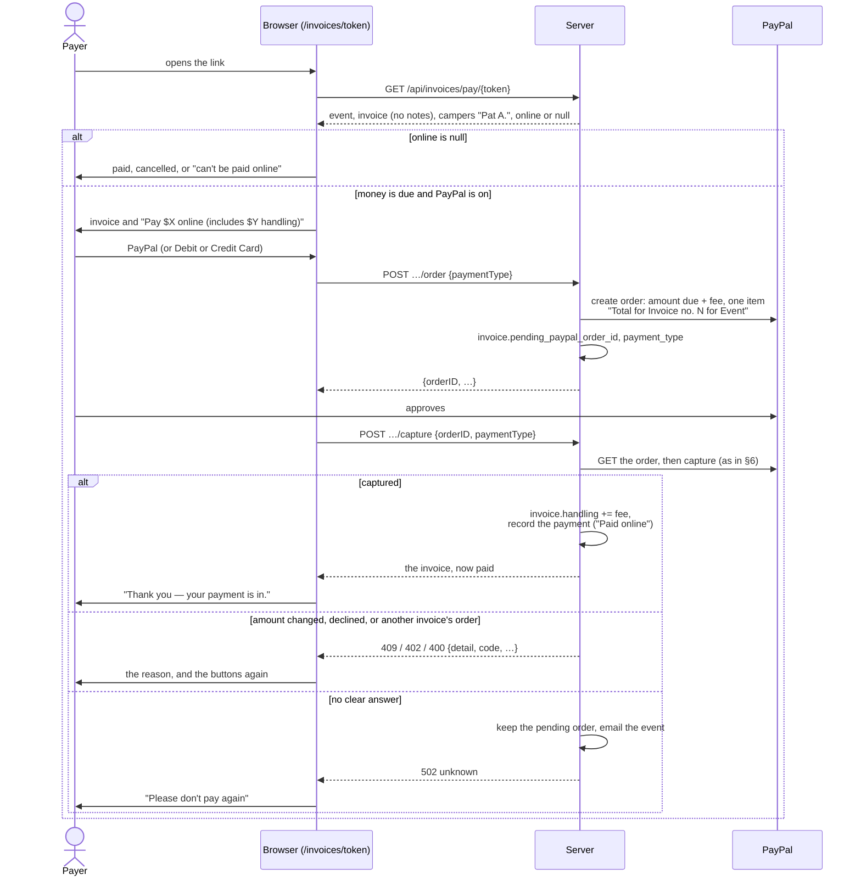

- **The same machinery as registration.** `InvoicePayView` calls `create_paypal_order` and
  `capture_paypal_order` (§6), so the checks, the single item, `paypal_transaction_id`, the
  PayPal problem email and "Check PayPal order" all work the same. Only the token decides which
  invoice; the order's `custom_id` must match it, or the capture is a `mismatch`.
- **Check first, PayPal later (#623).** A `registration` invoice the registrant chose to pay by
  check has `handling` 0. Paying it here adds `online_fee` on what's still due, at the capture —
  never before, so an abandoned order still adds nothing. An invoice that already carries a fee
  gets none added.
- **What the page shows**, and doesn't (DR-95). The link may be forwarded, so: the event's name;
  the invoice's number, description, memo, due date, amount, handling, paid and due, and status;
  the campers as first name and last initial. Never the invoice's notes, the registrant's email
  or the rest of the registration. A token of an incomplete registration's invoice is a 404, like
  an unknown one.
- **Abuse.** The endpoints are open to anyone, so they're throttled per client (scope
  `invoice_pay`, `CAMPHORIC_INVOICE_PAY_RATE`, 60 a minute by default). Guessing a 32-character
  random token isn't practical, and the throttle keeps anyone from trying wholesale.
- **A pending order.** When an order on the invoice hasn't been confirmed (`pending`), the page
  asks the payer not to pay again; a registrar settles it with "Check PayPal order".
