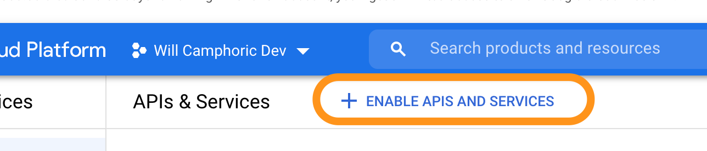

# Setting up your google API key for address autocomplete

1. Follow these instructions to create a project and get an api key:
   https://developers.google.com/maps/documentation/javascript/get-api-key
2. Go to your project dashboard and click on "Enable APIs and Services"
   
3. Activate the Places API for your new key
4. Create the following file if it doesn't exist:
   `<project_root>/client/.env.local`
5. Add the following line to that file:
   `REACT_APP_GOOGLE_API_KEY=<your api key here>`
